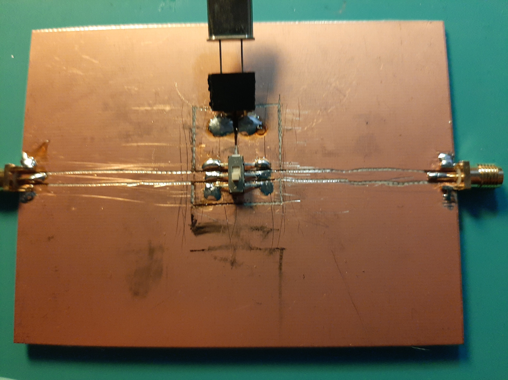

                                                                      
# Measure Crystal Characteristics Automatically Using a NanoVNA


## Introduction

Use this script to automatically characterize your crystals
using a test fixture and a Nanovna.  The script will search for 
the series resonant point of the crystal and from there
make measurements.  It will also search for the parallel resonant point 
of the crystal, if the --stray option is given, to find the crystal's holder 
capacitance.

The script operates by drilling the Nanovna down to the series resonance point 
of the crystal and measuring its Cm, Lm, and Rm values using the phase shift 
method.  When the measurement is finished the Nanovna's 
sweep frequency range will be restored to what it was before the script was run.

## How to use

First set the start and stop "stimulus" values of the Nanovna to encompass the range
of frequencies you expect to see from your batch of crystals.  The 
frequency span should be large enough to capture
both the series and parallel resonant points of your crystals.  I
have been using a span of 100KHz.

Next calibrate the thru port of the Nanovna using the "calib" menu.
Now you can run the script to make the measurement.  Pass the --stray option 
if you want to measure the holder capacitance.  The options --start and --stop
set the initial sweep frequency range.

The arguments to the python script follow:

                                                                 
```
$ crystalweb.py --help
usage: crystalweb.py [-h] [--fixture] [--loss] [--batch] [--theta THETA]
                     [--stray STRAY] [--repeat REPEAT] [--load LOAD]
                     [--part-name PART_NAME] [--part-number PART_NUMBER]
                     [--device DEVICE] [--start START] [--stop STOP]
                     [--capture]

optional arguments:
  -h, --help            show this help message and exit
  --fixture             measure test fixture stray capacitance (default:
                        False)
  --loss                measure test fixture loss (default: False)
  --batch               perform a batch measurement of crystals (default:
                        False)
  --theta THETA         phase angle for measuring bandwidth (default: 45)
  --stray STRAY         test fixture stray capacitance in pF, affects Co
                        (default: None)
  --repeat REPEAT       number of times to repeat measurements (default: 10)
  --load LOAD           test fixture source and load resistance (default: 50)
  --part-name PART_NAME
                        name of part (default: X)
  --part-number PART_NUMBER
                        number of part (default: 1)
  --device DEVICE       name of serial port device (default: None)
  --start START         starting frequency of initial sweep (default: None)
  --stop STOP           stopping frequency of initial sweep (default: None)
  --capture             capture screenshots of the measurements as
                        movie_xx.png (default: False)
```


Besides measuring crystals, the script can also measure the
stray capacitance of a test fixture using the "--fixture" measurement option.
The stray capacitance is used to measure the holder capacitance of the
crystal.  To find the stray capacitance, first calibrate the thru of the NanoVNA.
Next leave the fixture open 
and run "crystalweb.py --fixture".  The "--loss" measurement is like the "--fixture"
measurement except it returns the loss through the fixture instead of the capacitance.

## Example

The script, as it measures the crystal, writes the results to stderr.  At the
conclusion of the measurement, the script writes a final comma separated 
formatted line, listing all the measurements previously found, to stdout.
The CSV header for this line is 'XTAL,FS,CM,LM,RM,QU,CO'.

For example, I executed the following to measure a 7.03 Mhz crystal:

```
$ crystalweb.py --stray 1.1 --title X1
TITLE: X1
RL    = 50.0 ohm
fs    = 7027674 Hz
Rm    = 18.39 ohm
Cm    = 0.0149 pF
Lm    = 34.3163 mH
Qu    = 82401
stray = 1.10 pF
fp    = 7039743 Hz
Co    = 3.25138 pF
X1,7027674,1.4946e-14,0.034316,18.39,82401,3.2514e-12
```

### My test fixture




