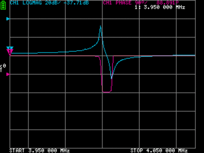

                                                                      
# Measure Crystal Characteristics Automatically Using a NanoVNA



## Introduction

Use this program to automatically characterize your crystals
using a test fixture and a Nanovna.  The script will search for 
the series frequency resonant point of the crystal and from there
make measurements.  It will also search for the parallel resonant point 
of the crystal, if the stray option is given, to find the crystal's holder 
capacitance.

The script operates by drilling the Nanovna down to the series resonance point 
of the crystal and measures its Cm, Lm, and Rm values using the phase shift 
measurement method.  When the measurement is finished the Nanovna's 
sweep frequency range will be restored to what it was before the script was run.

## How to use

First set the start and stop "stimulus" 
start values of the Nanovna to encompass the range
of frequencies you expect to see from your batch of crystals.  The 
frequency span should be large enough to capture
both the series and parallal resonant points of your crystals.  I
have been using a span of 100KHz.

Next calibrate the thru port of the Nanovna using the "calib" menu.

Next run the script passing the --stray option if you want the holder
capacitance to be measured as well.  The options --start and --stop
set the initial sweep frequency range.

The arguments to the python script follow:

                                                                 
```
$ crystalweb.py --help
usage: crystalweb.py [-h] [--fixture] [--loss] [--theta THETA] [--stray STRAY]
                     [--repeat REPEAT] [--load LOAD] [--title TITLE]
                     [--device DEVICE] [--start START] [--stop STOP]
                     [--capture]

optional arguments:
  -h, --help       show this help message and exit
  --fixture        measure test fixture stray capacitance (default: False)
  --loss           measure test fixture loss (default: False)
  --theta THETA    phase angle for measuring bandwidth (default: 45)
  --stray STRAY    test fixture stray capacitance in pF, affects Co (default:
                   None)
  --repeat REPEAT  number of times to repeat measurements (default: 10)
  --load LOAD      test fixture source and load resistance (default: 50)
  --title TITLE    title of measurement (default: )
  --device DEVICE  name of serial port device (default: None)
  --start START    starting frequency of initial sweep (default: None)
  --stop STOP      stopping frequency of initial sweep (default: None)
  --capture        capture screenshots of the measurements as movie_xx.png
                   (default: False)
```


Besides measuring crystals, the script can also measure the
stray capacitance of a test fixture using the "--fixture" option.

## Example

As the script measures a crystal it writes to stderr the result.  At the
conclusion of the measurement it then writes to stdout a comma separated 
formatted line of all the values found.  The csv header is for this
line is 'XTAL,FS,CM,LM,RM,QU,CO'.

For example here I used the script to measure a 7.03 Mhz crystal:

```
$ crystalweb.py --stray 1.1 --title X1
TITLE: X1
RL    = 50.0 ohm
fs    = 7027674 Hz
Rm    = 18.39 ohm
Cm    = 0.0149 pF
Lm    = 34.3163 mH
Qu    = 82401
stray = 1.10 pF
fp    = 7039743 Hz
Co    = 3.25138 pF
X1,7027674,1.4946e-14,0.034316,18.39,82401,3.2514e-12
```


